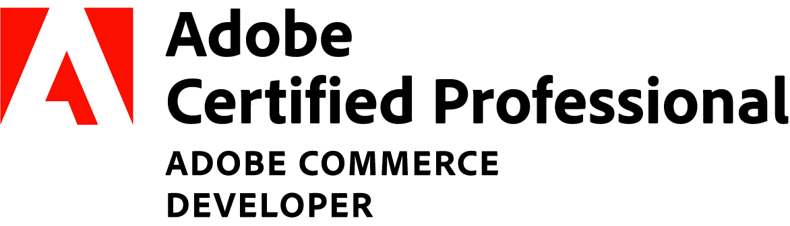

### Oh, greetings, fellow humans!

_My philosophy on life: You can learn anything you want and thus become anyone you want_

- Based in Copenhagen, Denmark :round_pushpin:
- Working for Visma Digital Commerce :briefcase:
- Adobe Certified Professional - Adobe Commerce Developer :books:
- Experience with PHP (Magento 2), HTML, CSS (Less, Sass), SQL, JavaScript/TypeScript/Node.js (React, Express.js), Git/GitHub/Bitbucket :point_up:
- Currently learning Go :eyes:
- Having a special keeness for clean and efficient code :pinched_fingers:

Wanna know more about me? You can write me in Danish, English, German, Croatian and Russian

